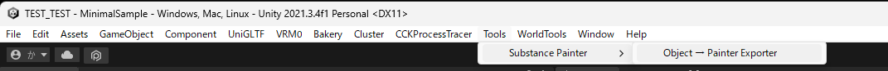
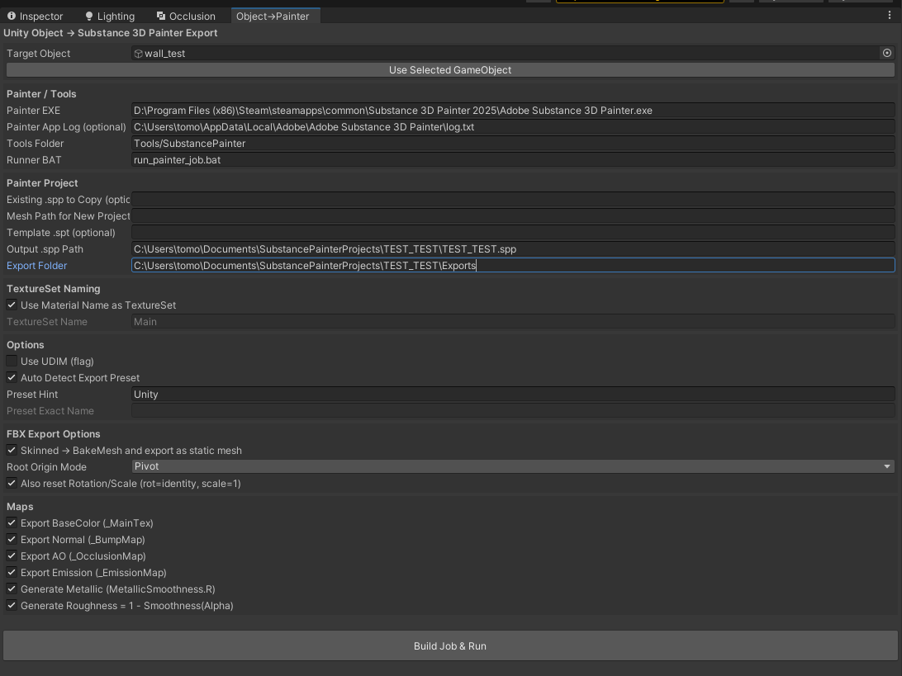

# UnityとSubstance 3D Painterの自動連携構築の進捗と課題
UnityとSubstance 3D Painterの自動連携を構築中です。  
「Built-In Render Pipeline(BPR)」として作られたUnityのシーンプロジェクトがあります。  
このプロジェクトにあるStandardシェーダのオブジェクトにマテリアルを貼り付けたいと思っています。  
ただ、テクスチャは"Substance 3D Painter"で作成したものを使用したいです。  
"Substance 3D Painter"で作成したテクスチャデータをUnityのBPRで表現できるようにするためのエクスポート機能を作成する。  
UnityのEditor拡張用スクリプト（Assets\Editor配下に配置）と、PainterのPythonスクリプト（Tools配下に配置）を作成して、UnityからPainterへ処理を渡すための仕組みを構築する。

## 前提
- Windows想定（bat/py）
- Unity 2021.3.4f1 または Unity 6
- Package Managerで「FBX Exporter（com.unity.formats.fbx）」を導入済み
- Painter は `--enable-remote-scripting` で起動（バッチで自動起動します）
- Python 3.x（`py -3` が使える環境）

# 対象とするUnityのバージョン
- Windows版 Unity 2021.3.4f1
- Windows版 Unity 6000.2.6f2

# 対象とするAdobe Substance 3D Painterのバージョン
- Windows版 Adobe Substance 3D Painter 11.0以降（Steam版、スタンドアロン版両方）

# ファイル構成
## Assets\Editor
* UnityToPainterExporter.cs
- UnityからFBXを書き出すためのスクリプト
* SubstancePainterObjectExporterWindow.cs
  - UnityからSubstance 3D Painterへ処理を渡すための処理を行う。Editorエディタ拡張スクリプト
  - Unityで設定されているマテリアル情報、Substance 3D Painterへ処理を渡すための情報を記載したjob.json、をエディタ上で設定しているパスに書き出し、Painter側で処理するためのスクリプトを呼び出す（run_painter_job.bat）
## Tools\SubstancePainter
* lib_remote.py
  - Painterを--enable-remote-scriptingで起動した"Substance 3D Painter"に対して、HTTPリクエストを送るためのライブラリ
* run_painter_job.py
  - Painterを--enable-remote-scriptingで起動させる、新規spp作成、Unityから出力されたマテリアルを反映、save_as後にreopenしてPainter側でFBXを読み込むためのスクリプト
* run_painter_job.bat
  - run_painter_job.pyを呼び出すためのバッチファイル

# UnityToPainterExporter.csを通してUnity上で設定できる項目
## メニュー
* Unityのメニューに「Tools - Substance 3D Painter - Object → Substance 3D Painter Exporter」という項目が追加される。([MenuItem("Tools/Substance 3D Painter/Object → Substance 3D Painter Exporter")])  

## エディタ拡張部
* Unityのエディタ上に「Object→Substance3DPainter」というウィンドウが表示される。  

  - Target Object: Unityのシーン上にあるGame Objectを選択するためのフィールド。 Substance 3D Painterへ渡したいオブジェクトを選択する。
  - [Painter / Tools]
    - Painter EXE:  Substance 3D Painterの実行ファイルを選択するためのフィールド。 例: C:\Program Files\Adobe\Adobe Substance 3D Painter\Substance Painter.exe
    - Painter App Log (optional): Painterのログファイルを選択するためのフィールド。 Painterの処理が成功したかどうかを確認するために使用する。 例: C:\Users\ユーザー名\AppData\Local\Temp\SubstancePainterRemoteScripting.log
    - Tools Folder: PainterのPythonスクリプトが配置されているフォルダを選択するためのフィールド。 例: Tools\SubstancePainter
    - Runner BAT: PainterのPythonスクリプトを呼び出すためのバッチファイルを選択するためのフィールド。 例: run_painter_job.bat
  - [Painter Project]
    - Mesh Path for New Project (optional): Painterで新規プロジェクトを作成する際に、Unityから出力されたFBXファイルを読み込むためのパスを選択するためのフィールド。 設定されていない場合、FBXを新規作成します。 例: C:\Users\ユーザー名\AppData\Local\Temp\UnityToPainterExportedMesh.fbx
    - Template .spt (optional): Painterで新規プロジェクトを作成する際に、テンプレートとして使用する.sptファイルを選択するためのフィールド。 設定されていない場合、Painterのデフォルトのテンプレートが使用されます。 例: C:\Users\ユーザー名\AppData\Local\Temp\UnityToPainterTemplate.spt
    - Output .spp Path: Painterで新規プロジェクトを作成した際の.sppファイルの出力先を選択するためのフィールド。(書き込み権限必須のフォルダを指定すること) 例: C:\Users\ユーザー名\AppData\Local\Temp\UnityToPainterExportedProject.spp
    - Export Folder: Painterでテクスチャを書き出す際の出力先を選択するためのフィールド。(書き込み権限必須のフォルダを指定すること) 例: C:\Users\ユーザー名\AppData\Local\Temp\UnityToPainterExportedTextures
  - [TextureSet Naming]
    - Use Material Name as TextureSet: Unityのマテリアル名をPainterでテクスチャを書き出す際のTextureSetの名前として使用するかどうかを指定するためのフィールド。 チェックを入れると、Unityのマテリアル名がPainterのTextureSetの名前として使用される。 例: チェックを入れると、Unityのマテリアル名が"Material"の場合、PainterのTextureSetの名前も"Material"になる。
    - TextureSet Name: Painterでテクスチャを書き出す際のTextureSetの名前を指定するためのフィールド。 例: UnityExportedTextureSet
  - [Options]
    - Use UDIM (flag): Painterでテクスチャを書き出す際にUDIMを使用するかどうかを指定するためのフィールド。 チェックを入れると、Painterでテクスチャを書き出す際にUDIMが使用される。(UDIM自体は「プロジェクトがUV Tiles workflowで作られている」必要があり) 例: チェックを入れると、Painterでテクスチャを書き出す際にUDIMが使用される。
    - Auto Detect Export Preset: Painterでテクスチャを書き出す際のエクスポートプリセットを自動で検出するかどうかを指定するためのフィールド。 チェックを入れると、Painterでテクスチャを書き出す際のエクスポートプリセットが自動で検出される。 例: チェックを入れると、Painterでテクスチャを書き出す際のエクスポートプリセットが自動で検出される。
    - Preset Hint: Painterでテクスチャを書き出す際のエクスポートプリセットの名前を指定するためのヒント。 例: Unity Built-In Render Pipeline (Packed)
    - Preset Exact Name: Painterでテクスチャを書き出す際のエクスポートプリセットの正確な名前を指定するためのフィールド。 例: Unity Built-In Render Pipeline (Packed)
  - [FBX Export Settings]
    - Skinned → BakeMesh and export as static mesh: UnityのSkinned Mesh RendererをFBXに書き出す際に、スキニングをベイクしてスタティックメッシュとしてエクスポートするかどうかを指定するためのフィールド。 チェックを入れると、UnityのSkinned Mesh RendererがFBXに書き出される際に、スキニングがベイクされてスタティックメッシュとしてエクスポートされる。 例: チェックを入れると、UnityのSkinned Mesh RendererがFBXに書き出される際に、スキニングがベイクされてスタティックメッシュとしてエクスポートされる。
    - Root Origin Mode: UnityのFBXエクスポートにおいて、ルートオリジンの位置をどのように設定するかを指定するためのフィールド。 Off / Pvot / Bounds Center から選択する。 例: Offを選択すると、UnityのFBXエクスポートにおいて、ルートオリジンの位置がオフセットされない。
    - Also reset Rotation/Scale (rot=identity, scale=1): UnityのFBXエクスポートにおいて、回転とスケールもリセットするかどうかを指定するためのフィールド。 チェックを入れると、UnityのFBXエクスポートにおいて、回転がアイデンティティ（0,0,0）に、スケールが1にリセットされる。 例: チェックを入れると、UnityのFBXエクスポートにおいて、回転がアイデンティティ（0,0,0）に、スケールが1にリセットされる。
  - [Maps]
    - xport BaseColor (_MainTex): Unityのマテリアルの_MainTexに対応するBaseColorマップをエクスポートするかどうかを指定するためのフィールド。 チェックを入れると、Unityのマテリアルの_MainTexに対応するBaseColorマップがエクスポートされる。 例: チェックを入れると、Unityのマテリアルの_MainTexに対応するBaseColorマップがエクスポートされる。
    - Export Normal (_BumpMap): Unityのマテリアルの_BumpMapに対応するNormalマップをエクスポートするかどうかを指定するためのフィールド。 チェックを入れると、Unityのマテリアルの_BumpMapに対応するNormalマップがエクスポートされる。 例: チェックを入れると、Unityのマテリアルの_BumpMapに対応するNormalマップがエクスポートされる。
    - Export AO (_OcclusionMap): Unityのマテリアルの_OcclusionMapに対応するAOマップをエクスポートするかどうかを指定するためのフィールド。 チェックを入れると、Unityのマテリアルの_OcclusionMapに対応するAOマップがエクスポートされる。 例: チェックを入れると、Unityのマテリアルの_OcclusionMapに対応するAOマップがエクスポートされる。
    - Export Emission (_EmissionMap): Unityのマテリアルの_EmissionMapに対応するEmissionマップをエクスポートするかどうかを指定するためのフィールド。 チェックを入れると、Unityのマテリアルの_EmissionMapに対応するEmissionマップがエクスポートされる。 例: チェックを入れると、Unityのマテリアルの_EmissionMapに対応するEmissionマップがエクスポートされる。
    - Generate Metallic (MetallicSmoothness.R): UnityのStandardシェーダのMetallicスロットに対応するMetallicマップを生成するかどうかを指定するためのフィールド。 チェックを入れると、UnityのStandardシェーダのMetallicスロットに対応するMetallicマップが生成される。 例: チェックを入れると、UnityのStandardシェーダのMetallicスロットに対応するMetallicマップが生成される。
    - Generate Roughness = 1 - Smoothness(Alpha): UnityのStandardシェーダのSmoothnessスロットに対応するRoughnessマップを生成するかどうかを指定するためのフィールド。 チェックを入れると、UnityのStandardシェーダのSmoothnessスロットに対応するRoughnessマップが生成される。 例: チェックを入れると、UnityのStandardシェーダのSmoothnessスロットに対応するRoughnessマップが生成される。

# Painter → Unity(BIRP/Standard) に合うテクスチャの作り方
1. Painter 側：プロジェクトの前提（重要）
* 推奨：PBR Metallic/Roughness で制作
* Painter のテクスチャセット設定は通常 Metallic/Roughness でOK（Unity Standard の “Metallic setup” に合う）
2. Painter 側：エクスポートはこのテンプレが基本
* 最優先：Unity 5 (Standard Metallic)
* File > Export Textures Output template：Unity 5 (Standard Metallic) を選択 これで、Unity の Standard( Metallic ) で使いやすい形にほぼ揃います。
3. Unity Standard（Metallic）の必要マップと“詰め方”
* Standard シェーダ（Metallic）での基本対応：
  - Base Map（Albedo） Painter：BaseColor Unity：Albedo にそのまま
  - Normal Painter：Normal Unity：Normal Map にそのまま（インポート設定で Normal にする）
  - Metallic + Smoothness（ここが一番の肝） 
  - Unity Standard の Metallic ワークフローは基本的に、「Metallic：R チャンネル」／「Smoothness：A チャンネル（アルファ）」の 1枚テクスチャ（通称 MetallicSmoothness） を想定。 
  - Painter の Unity 5 (Standard Metallic) は通常この形で出力：
    - MetallicSmoothness（RGBA）：R = Metallic
    - A = Smoothness（= 1 - Roughness）  
    ※もしあなたの出力が「Roughness」のまま出ている場合は、Roughness を反転して Smoothness にする必要があります（後述）。
  - Occlusion（AO） Painter：Ambient Occlusion Unity：Occlusion スロットへ（通常は単体テクスチャ）
  - Emission（使う場合）
    - Painter：Emissive
    - Unity：Emission（必要に応じてシェーダ側で Emission 有効化）
4. よくある落とし穴：Roughness → Smoothness の扱い
* Unity Standard は Smoothness（ツルツル）で、Painter は多くの場合 Roughness（ザラザラ）です。
* Smoothness = 1 - Roughness
*Unity 5 (Standard Metallic) を使っていれば、たいてい自動で Smoothness を作って A に入れてくれますが、もしテンプレやカスタムで Roughness をそのまま出しているなら、以下のどちらかで対応します。
  - 対応A（おすすめ）：Painter のテンプレを Unity Standard 用にする Unity 5 (Standard Metallic) を使う（まずこれ）
  - 対応B：カスタム書き出しで A に Smoothness を詰める Export preset / Output template を編集して A = (1 - Roughness) を出すように設定
5. Unity 側：インポート設定（ここも超重要）
* Unity のテクスチャ Import Settings は、見た目に直結します。
  - Albedo / Emission: sRGB（Color Texture）= ON
  - MetallicSmoothness / Occlusion（いわゆるデータテクスチャ）: sRGB（Color Texture）= OFF MetallicSmoothness は Alpha チャンネルを Smoothness に使う前提 （Unity Standard 側で Smoothness source を Metallic Alpha にするのが一般的）
  - Normal: Texture Type：Normal map sRGB は概念的に色ではないので、通常 Unity が正しく扱う設定になります
6. 書き出し形式のおすすめ（実務向け）
  - PNG / TGA：一般的で扱いやすい（アルファも持てる）
  - MetallicSmoothness は **必ずアルファ付き（RGBA）**で出す（Smoothness を A に入れるため）
  - 8bit で基本十分（超高品質狙い・法線の劣化が気になるなら 16bit 検討）
7. もし「Standard (Specular setup)」を使いたい場合
Unity の Standard を Specular setup で使う場合は、Painter 側テンプレを「Unity 5 (Standard Specular)」に変えます。  
この場合は、Specular（RGB）／Smoothness（A）のテクスチャが中心になります。  
ただ、迷っているなら Metallic の方が無難です（情報も多く、運用も楽）。  
対象は Unity Built-in Render Pipeline / Standard（Metallic） を想定します。
Unity Standard（Metallic）で一般的な構成
* [UnityのStandard Shader（Metallic）でのテクスチャ構成]
スロット|実体
Albedo|BaseColor（RGB）
Normal|Normal
Metallic|Metallic（R）＋ Smoothness（A）
Occlusion|AO
Emission|Emissive（任意）  
👉 Metallic と Smoothness が1枚に詰め込まれているのが最大のクセです。  

* [Unity テクスチャ → Painter チャンネル対応表]
ここが変換の核心です。
Unity と Painter で呼び方が違うものもあるので、対応表を作りました。
Unity|Painter
Albedo (RGB)|Base Color
Normal|Normal
Metallic (R)|Metallic
Smoothness (A)|Roughness（反転）
Occlusion|Ambient Occlusion
Emission|Emissive

* [UnityのetallicとSmoothnessのチャンネル配置]
MetallicはMetallicに適用したテクスチャのRGBAのRの値が、SmoothnessはRGBAのAの値(アルファチャンネル)が使われる。  
また、UnityのSmoothnessで使うAlphaの値は「Albedo Alpha」と「Metallic Alpha」の2種類から指定でき、AlbedoまたはMetallicにあてがわれたテクスチャのうち、選んだ方のアルファチャンネルが参照される。  

* [Smoothness → Roughness の変換（最重要）]
Substance 3D Painter は Roughness、Unity Standard は Smoothness。  
下記数式の通り行うには、Unity で一度 RenderTexture に焼いて反転が必要。  
  
  ` [数式] Roughness = 1 - Smoothness `  
    
  👉 Substance Painter 内でレイヤーを使って反転（後述：[Painter 内で Smoothness を反転する方法（便利）]を参照）
* [Painter への具体的インポート手順（安全手順）]
手順①：テクスチャを読み込む  
  File > Import Resources  
  Type：Texture  
  Import to：Project  
手順②：Texture Set Settings で割り当て
  Texture Set Settings パネル  
  各スロットに以下を割り当て：  
    Base Color  
    　→ Unity の Albedo  
    Normal  
    　→ Unity の Normal  
  Metallic  
  　→ MetallicSmoothness テクスチャ  
    　  （※ R チャンネルのみ使われる）  
  Roughness（ここがポイント）  
  　MetallicSmoothness の Alpha  
  　そのままでは逆なので後処理が必要  
* [Painter 内で Smoothness を反転する方法（便利）]
Photoshop 等を使わず、Painter 内で完結させる方法です。  
-方法-  
  Fill Layer を作成  
  Roughness のみ ON  
  Roughness に MetallicSmoothness テクスチャを指定  
  チャンネル設定で Invert（反転）  
    　👉 これでUnity 見た目 ≒ Painter 見た目 になります。
* [AO / Emission について]  
AO  
  　→ Texture Set Settings の Ambient Occlusion に直接割り当て  
Emission  
  　→ Emissive に割り当て（Viewer で Emissive ON）

# テクスチャファイル出力規則
- *_BaseColor.png
- *_Normal.png
- *_AO.png
- *_Emissive.png
- *_Metallic.png
- *_Roughness.png（Smoothness を反転）
- *_ORM.png（R=AO / G=Rough / B=Metal）

# テクスチャをSubstance 3D PainterからUnityにインポートする際の注意点
* UnityのStandardシェーダで正しく表示させるためには、テクスチャのチャンネル配置やインポート設定が重要です。 特に、MetallicとSmoothnessは1枚のテクスチャに詰め込まれていることが多いため、正しいチャンネルに割り当てる必要があります。
  - TextureSet → ts.all_stacks() で stack が取れる
  - layerstack.get_root_layer_nodes(stack) が 動く（PaintLayerNode が返る）
  - InsertPosition は列挙型ではなく ビルダー  
    → InsertPosition.from_textureset_stack(stack) が 成功  
  - insert_fill(position) が 成功し、FillLayerNode が作れる
  - FillLayerNode.set_source(channeltype, resourceID or Color ...) がある  
    → つまり テクスチャを resource として import して ResourceID を作れば貼れる  
  - ChannelType は正しく解決できている
    BaseColor → ChannelType.BaseColor  
    Normal → ChannelType.Normal  
  - ts.all_stacks() で stack 取得
  - InsertPosition.from_textureset_stack(stack)
  - ls.insert_fill(position)
  - resource.import_project_resource(path, usage)
  - fill.set_source(ChannelType.BaseColor, resource_id)  
    ※resource → ResourceID(resource_id) 変換して set_source

# 参考資料
 - [Unity C# Script API Reference](https://docs.unity3d.com/6000.3/Documentation/ScriptReference/index.html)
 - [Substance 3D Painter Python API Reference](https://helpx.adobe.com/substance-3d-painter-python/api.html)
 - [Substance 3D Painter GitHub Pages](https://adobedocs.github.io/painter-python-api/)
 - [Unity - Manual: Metallic mode: Metallic Parameter](https://docs.unity3d.com/Manual/StandardShaderMaterialParameterMetallic.html)
 - [Smoothness - Unity マニュアル](https://docs.unity3d.com/ja/2017.4/Manual/StandardShaderMaterialParameterSmoothness.html)
 - [シェーディング - Unity マニュアル](https://docs.unity3d.com/ja/2017.4/Manual/BestPracticeMakingBelievableVisuals5.html)
